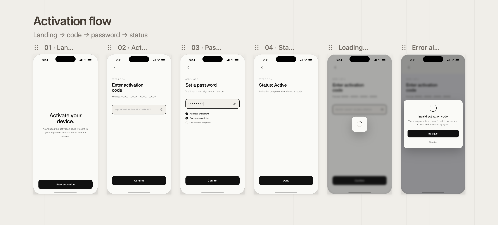

# PowerAuthApp

An iOS app built as a homework assignment for Wultra. It integrates the [PowerAuth Mobile SDK](https://github.com/wultra/powerauth-mobile-sdk-spm) and walks the user through a three-step activation flow: entering an activation code, setting a password, and confirming the resulting activation status.

---

## Activation Flow



**Landing → activation code → password → status**

| Screen | What happens |
|---|---|
| **Landing** | Entry point. If the device is already activated, the user lands directly on the Status screen. Otherwise, tapping *Start activation* initialises the SDK and navigates forward. |
| **Activation code** | The user types their one-time activation code (`XXXX-XXXX-XXXX-XXXX`). Tapping *Confirm* calls `createActivation(withName:activationCode:)` on the SDK. On success the app moves to the Password screen. |
| **Password** | The user creates a password that satisfies three inline rules (8+ characters, one uppercase letter, one number or symbol). Tapping *Confirm* calls `persistActivation(withPassword:)` to commit the activation to the keychain, then polls `fetchActivationStatus()` until the server transitions to `.active`. |
| **Status** | Displays *Status: Active* and a *Done* button that returns the user to the Landing screen. |

Loading and error states are present on every screen: a full-screen spinner blocks interaction while an async operation is in flight, and a modal error dialog appears on failure.

---

## Architecture

### Layer overview

```
PowerAuthApp
├── App/                   – App entry point, root NavigationStack
├── AuthService/           – SDK wrapper + protocol + types
├── Features/
│   ├── Launch/            – Animated splash screen
│   ├── Landing Page/      – Entry screen, SDK init trigger
│   ├── Activation/        – Activation code input
│   ├── Password/          – Password creation + persist
│   └── Result/            – Activation confirmed screen
├── DesignSystem/
│   ├── Components/        – InputField, PrimaryButton, ErrorAlert, LoadingHUD, …
│   ├── Colors.swift
│   └── Fonts.swift
└── Localization/          – AppStringKey enum + Localizable.xcstrings (EN + CS)
```

### Key concepts

**MVVM with `@Observable`**
Each screen owns a view model annotated with `@Observable @MainActor`. Views bind to the model via `@Bindable`. No view ever calls the SDK directly — all side effects go through the service layer.

**`AuthServiceProtocol`**
The protocol decouples the views and view models from the concrete `AuthService`. The five operations — `isConfigured`, `hasValidActivation`, `configure()`, `createActivation(with:)`, `persistActivation(with:)`, `fetchActivationStatus()` — map one-to-one to the SDK chapters in the assignment.

**Dependency injection via [swift-dependencies](https://github.com/pointfreeco/swift-dependencies)**
`AuthService` conforms to `DependencyKey` and is registered as `DependencyValues.authService`. View models resolve it with `@Dependency(\.authService)`. This keeps the service a singleton without passing it down the view hierarchy manually.

**Async/await bridging**
The PowerAuth SDK uses completion callbacks. Both `createActivation` and `fetchActivationStatus` are bridged to async/await with `withCheckedThrowingContinuation`, so the calling view model can use structured concurrency with a clean `do/try/await` chain.

**`pendingCommit` retry loop**
After `persistActivation` the server may not have propagated the state change yet. `PasswordViewModel` polls `fetchActivationStatus()` up to three times with a two-second pause between attempts before surfacing an error, avoiding spurious failures on slow networks.

**`@MainActor` isolation**
`AuthService` is `@MainActor`-isolated, matching the isolation of the view models that call it. This eliminates data races on `powerAuthSDK` under Swift 6 strict concurrency without requiring an `actor` and an `await` at every call site.

**Navigation**
A single `NavigationStack` lives at the root (`ContentView`). Each screen drives forward navigation through a `@Published`-equivalent `Bool` property on its view model passed to `navigationDestination(isPresented:)`. Back navigation is disabled on the Activation, Password, and Status screens — the flow is strictly linear.

---

## SDK Configuration

| Key | Value |
|---|---|
| Base endpoint URL | `https://stable-mtoken-dev.wultra.app/enrollment-server` |
| Instance ID | `romansiro.PowerAuthApp` (bundle identifier) |
| Configuration | see `PowerAuthConfig.swift` |

---

## Requirements

- Xcode 16+
- iOS 17+ deployment target
- Swift 6
- Dependencies resolved via Swift Package Manager (automatic on first build)

### Dependencies

| Package | Purpose |
|---|---|
| [powerauth-mobile-sdk-spm](https://github.com/wultra/powerauth-mobile-sdk-spm) `1.9.6` | PowerAuth2 SDK |
| [swift-dependencies](https://github.com/pointfreeco/swift-dependencies) | Dependency injection |
